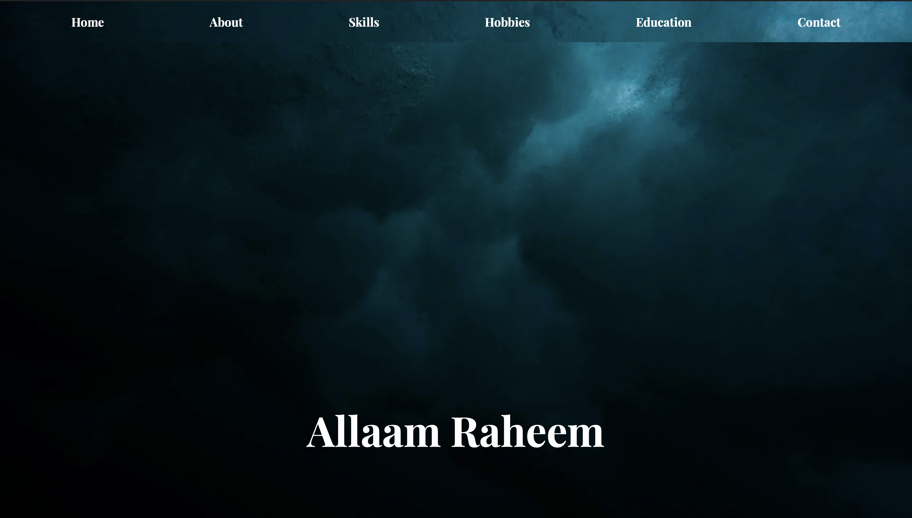
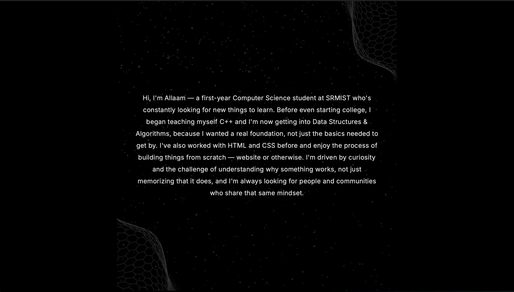
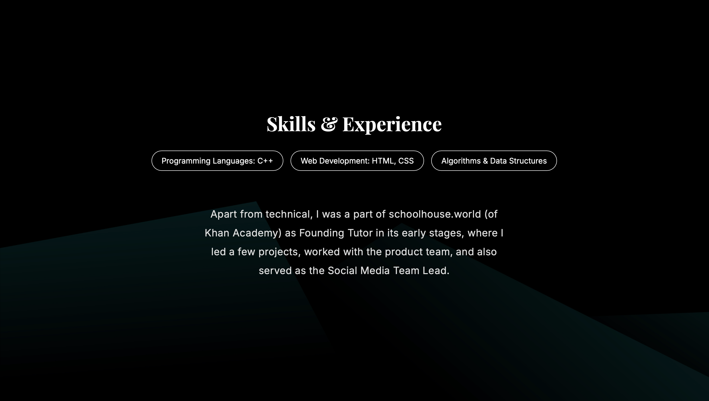
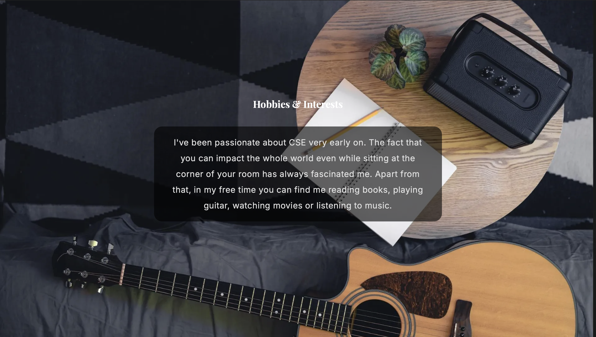
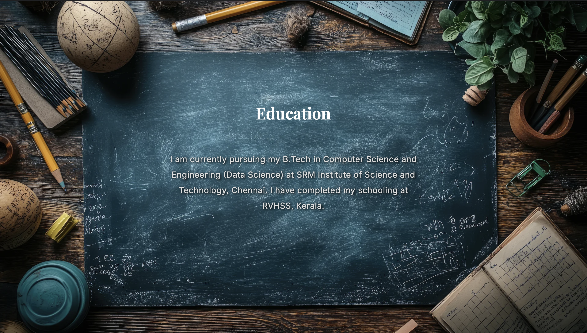
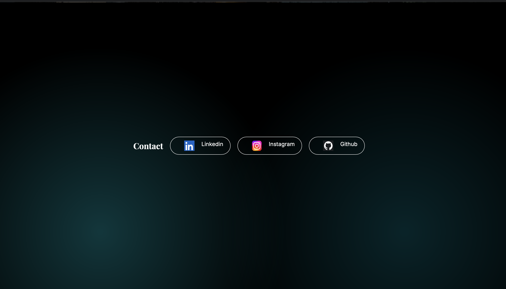

# Personal Portfolio

## 1. Project Title

Personal Portfolio Website

## 2. Objective

A personal portfolio website created to showcase my background, skills,
interests, education, and contact information in a clean and interactive
design.

## 3. Problem Statement

The purpose of this project is to create a central online space where my
technical skills, education, interests, and personal background can be
presented clearly.

## 4. Tech Stack

- HTML5
- CSS3
- Google Fonts
- Git & GitHub
- GitHub Pages

## 5. Implementation Approach

The website was built from scratch using HTML and CSS.

The website is divided into different sections:

- Home
- About
- Skills
- Hobbies & Interests
- Education
- Contact

CSS Flexbox was used for arranging and aligning elements. Background images,
typography, hover effects, transitions, and responsive styling were used to
create the visual design.

Jpg images were affecting the website's loading time, so images were converted to WebP format to reduce file sizes and improve tghe overall loading performance.

## 6. Features

- Navigation between different sections
- Full-screen section layouts
- Hover effects
- Social media links
- Custom background images
- Responsive design
- Optimized WebP images
- GitHub Pages deployment


## 7. Screenshots

### Home



### About



### Skills & Experience



### Hobbies & Interests



### Education



### Contact



## 8. How to Run

### Live website

[View the live portfolio](https://allaamr18.github.io/personal-portfolio/)


### Run locally

No additional dependencies are required.


1. Clone the repository:

```bash
git clone https://github.com/allaamr18/personal-portfolio.git
    
```

## 9. Future Improvements

- Add a dedicated Projects section
- Improve mobile responsiveness
- Add more animations and interactions
- Add a downloadable resume
- Continue improving accessibility and performance
    
    